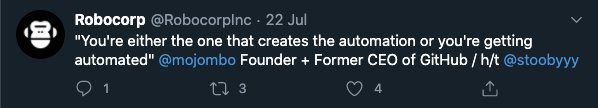

# A simple web scraper example robot

An example robot. Opens a web page and stores some content. The web page
text is stored in the "output" directory. An image screenshot is embedded in the log.

When run, the robot will:

- open a real web browser
- hide distracting UI elements
- scroll down to load dynamic content
- collect the latest tweets by a given [Twitter](https://twitter.com/) user
- create a file system directory by the name of the Twitter user
- store the text content of each tweet in separate files in the directory
- store a screenshot of each tweet in the directory



> Because Twitter blocks requests coming from the cloud, this robot can only be executed on a local machine or triggered from [Control Room](/control-room) using [Robocorp Assistant](/control-room/unattended).

## Robot script explained

After running it, the robot should have created a directory `output/tweets/RobocorpInc` containing images (screenshots of the tweets) and text files (the texts of the tweets).

### Tasks

The main robot file (`tasks.robot`) contains the [tasks](/languages-and-frameworks/robot-framework/tasks) your robot is going to complete when run:

```robot
*** Tasks ***
Store the latest tweets by given user name
    Open Twitter homepage
    Hide distracting UI elements
    Scroll down to load dynamic content
    Store the tweets
    [Teardown]    Close Browser
```

- `*** Tasks ***` is the [section](/languages-and-frameworks/robot-framework/syntax#sections) header.
- `Store the latest tweets by given user name` is the name of the task.
- `Open Twitter homepage`, etc., are [keyword](/languages-and-frameworks/robot-framework/keywords) calls.
- `[Teardown] Close Browser` ensures that the browser will be closed even if the robot fails to accomplish its task.

### Settings

```robot
*** Settings ***
Documentation       Opens the Twitter web page and stores some content.

Library             Collections
Library             RPA.Browser.Selenium
Library             RPA.FileSystem
Library             RPA.RobotLogListener
```

The `*** Settings ***` section provides short `Documentation` for the script and imports [libraries](/languages-and-frameworks/robot-framework/basics#what-are-libraries) (`Library`) that add new keywords for the robot to use. Libraries contain [Python](/languages-and-frameworks/python) code for things like commanding a web browser ([`RPA.Browser.Selenium`](/libraries/rpa-framework/rpa-browser-selenium)) or creating file system directories and files ([`RPA.FileSystem`](/libraries/rpa-framework/rpa-filesystem)).

### Variables

```robot
*** Variables ***
${USER_NAME}            RobocorpInc
${NUMBER_OF_TWEETS}     3
${TWEET_DIRECTORY}      ${CURDIR}${/}output${/}tweets/${USER_NAME}
${TWEETS_LOCATOR}       xpath://article[descendant::span[contains(text(), "\@${USER_NAME}")]]
```

[Variables](/languages-and-frameworks/robot-framework/variables) provide a way to change the input values for the robot in one place. This robot provides variables for the Twitter user name, the number of tweets to collect, the file system directory path for storing the tweets, and a [locator](/development-guide/browser/how-to-find-user-interface-elements-using-locators-in-web-applications) for finding the tweet [HTML](https://developer.mozilla.org/en-US/docs/Web/HTML) elements from the Twitter web page.

### Keywords

The `Keywords` section defines the implementation of the actual things the robot will do.

```robot
*** Keywords ***
Open Twitter homepage
    Open Available Browser    https://mobile.twitter.com/${USER_NAME}
    Wait Until Element Is Visible    css:main
```

The `Open Twitter homepage` keyword uses the [`Open Available Browser`](/libraries/rpa-framework/rpa-browser-selenium/keywords#open-available-browser) keyword from the [`RPA.Browser.Selenium`](/libraries/rpa-framework/rpa-browser-selenium) library to open a browser. It takes one required argument; the [URL](https://en.wikipedia.org/wiki/URL) to open:

```
https://mobile.twitter.com/${USER_NAME}
```

The `${USER_NAME}` variable is defined in the `*** Variables ***` section:

```
${USER_NAME}            RobocorpInc
```

The value of the variable is `RobocorpInc`. When the robot is executed, [Robot Framework](https://robotframework.org/) replaces the variable with its value, and the URL becomes `https://mobile.twitter.com/RobocorpInc`.

```robot
*** Keywords ***
Hide element
    [Arguments]    ${locator}
    Mute Run On Failure    Execute Javascript
    Run Keyword And Ignore Error
    ...    Execute Javascript
    ...    document.querySelector('${locator}').style.display = 'none'
```

The `Hide element` keyword takes care of getting rid of unnecessary elements from the web page when taking screenshots. The [`Mute Run On Failure`](/libraries/rpa-framework/rpa-robotloglistener/keywords#mute-run-on-failure) keyword from the [`RPA.RobotLogListener`](/libraries/rpa-framework/rpa-robotloglistener) library prevents the robot from saving a screenshot in case of failure (the default behavior on failure) when executing the [`Execute Javascript`](/libraries/rpa-framework/rpa-browser-selenium/keywords#execute-javascript) keyword. In this case, we are not really interested in these failures, so we decided to mute the failure behavior.

The `Execute Javascript` keyword executes the given [JavaScript](https://en.wikipedia.org/wiki/JavaScript) in the browser. The JavaScript expression contains a variable (`${locator}`) that is passed in as an [argument](/languages-and-frameworks/robot-framework/keywords#keyword-arguments) for the `Hide element` keyword.

```robot
*** Keywords ***
Hide distracting UI elements
    @{locators}=    Create List
    ...    header
    ...    \#layers > div
    ...    nav
    ...    div[data-testid="primaryColumn"] > div > div
    ...    div[data-testid="sidebarColumn"]
    ...    div[data-testid="inlinePrompt"]
    ...    div[data-testid="sheetDialog"]
    FOR    ${locator}    IN    @{locators}
        Hide element    ${locator}
    END
```

The `Hide distracting UI elements` keyword calls the `Hide element` keyword with locators pointing to all the elements we want the robot to hide from the web page. A [for loop](/languages-and-frameworks/robot-framework/for-loops) is used to loop through the [list](/languages-and-frameworks/robot-framework/variables#different-types-of-variables) of locators.

```robot
*** Keywords ***
Scroll down to load dynamic content
    FOR    ${pixels}    IN RANGE    200    2000    200
        Execute Javascript    window.scrollBy(0, ${pixels})
        Sleep    500ms
        Hide distracting UI elements
    END
    Execute Javascript    window.scrollTo(0, 0)
    Sleep    500ms
```

The `Scroll down to load dynamic content` keyword ensures that the dynamic content is loaded before the robot tries to store the tweets. It scrolls down the browser window, starting from 200 pixels from the top of the page, until 2000 pixels down, in 200-pixel steps. The [`Sleep`](/libraries/built-in/builtin/keywords#sleep) keyword provides some time for the dynamic content to load. Finally, the web page is scrolled back to the top.

```robot
*** Keywords ***
Get tweets
    Wait Until Element Is Visible    ${TWEETS_LOCATOR}
    @{all_tweets}=    Get WebElements    ${TWEETS_LOCATOR}
    @{tweets}=    Get Slice From List    ${all_tweets}    0    ${NUMBER_OF_TWEETS}
    RETURN    @{tweets}
```

The `Get tweets` keyword collects the tweet HTML elements from the web page using the [`Get WebElements`](/libraries/built-in/builtin/keywords#sleep) keyword. The [`Get Slice From List`](/libraries/built-in/collections/keywords#get-slice-from-list) keyword is used to limit the number of elements before [returning](/languages-and-frameworks/robot-framework/keywords#user-keywords-with-return-values) them using the `RETURN` keyword.

```robot
*** Keywords ***
Store the tweets
    Create Directory    ${TWEET_DIRECTORY}    parents=True
    ${index}=    Set Variable    1
    @{tweets}=    Get tweets
    FOR    ${tweet}    IN    @{tweets}
        ${screenshot_file}=    Set Variable    ${TWEET_DIRECTORY}/tweet-${index}.png
        ${text_file}=    Set Variable    ${TWEET_DIRECTORY}/tweet-${index}.txt
        ${text}=    Set Variable    ${tweet.find_element_by_xpath(".//div[@lang='en']").text}
        Capture Element Screenshot    ${tweet}    ${screenshot_file}
        Create File    ${text_file}    ${text}    overwrite=True
        ${index}=    Evaluate    ${index} + 1
    END
```

The `Store the tweets` keyword stores the text and the screenshot of each tweet. It uses the `Create Directory` keyword to create a file system directory, the `Set Variable` keyword to create local variables, the `Capture Element Screenshot` keyword to take the screenshots, the `Create File` keyword to create the files, and the `Evaluate` keyword to evaluate a Python expression.

The file paths are constructed dynamically using variables:

```
${TWEET_DIRECTORY}/tweet-${index}.png
```

## Summary

You executed a web scraper robot, congratulations!

During the process, you learned some concepts and features of the Robot Framework and some good practices:

- Defining `Settings` for your script (`*** Settings ***`)
- Documenting scripts (`Documentation`)
- Importing libraries (`Collections`, `RPA.Browser.Selenium`, `RPA.FileSystem`, `RPA.RobotLogListener`)
- Using [keywords](/languages-and-frameworks/robot-framework/keywords) provided by libraries (`Open Available Browser`)
- Creating your own keywords
- Defining [arguments](/languages-and-frameworks/robot-framework/keywords#keyword-arguments) (`[Arguments]`)
- Calling keywords with arguments
- Returning values from keywords (`RETURN`)
- Using [predefined variables](/languages-and-frameworks/robot-framework/variables#built-in-variables) (`${CURDIR}`)
- Using your own [variables](/languages-and-frameworks/robot-framework/variables)
- [Creating loops with Robot Framework syntax](/languages-and-frameworks/robot-framework/for-loops)
- Running teardown steps (`[Teardown]`)
- Opening a real browser
- Navigating to web pages
- Locating web elements
- Hiding web elements
- Executing Javascript code
- Scraping text from web elements
- Taking screenshots of web elements
- Creating file system directories
- Creating and writing to files
- Ignoring errors when it makes sense (`Run Keyword And Ignore Error`)
